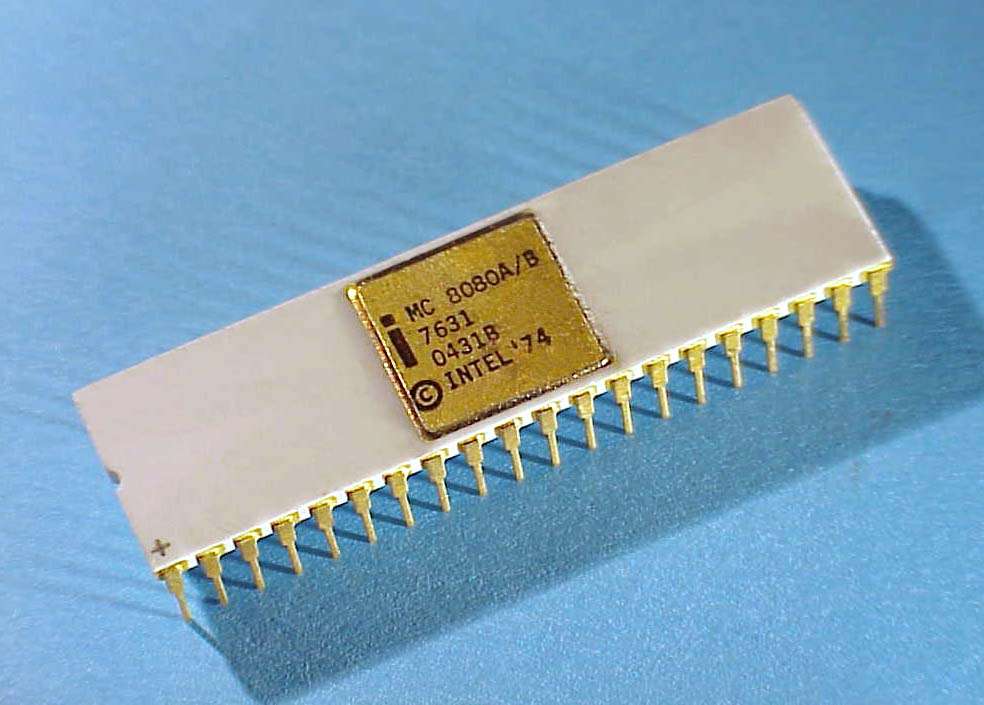

# lang8080

A toolchain for the 8080 architecture \
`Including a assembler, and compiler for a custom language`

> [!NOTE] 
> This project is in the early stages and doesn't have a detailed README.md

> [!NOTE] 
> This toolchain can also be used for regular Intel 8080 targets

## Building
Run `buildtoolchain.sh`
